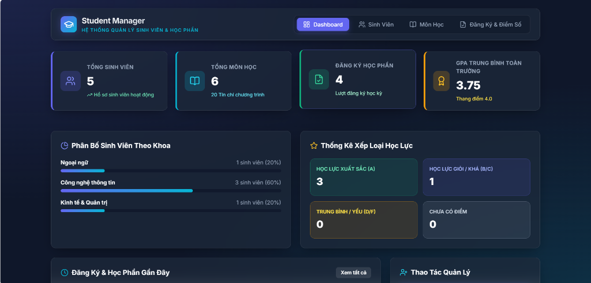
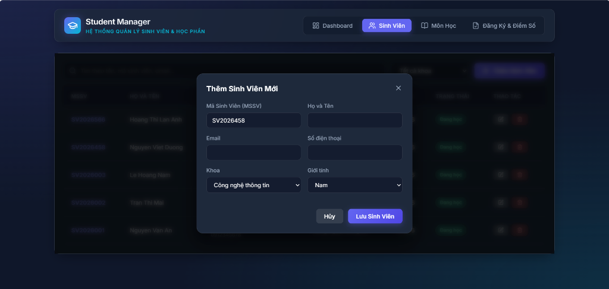
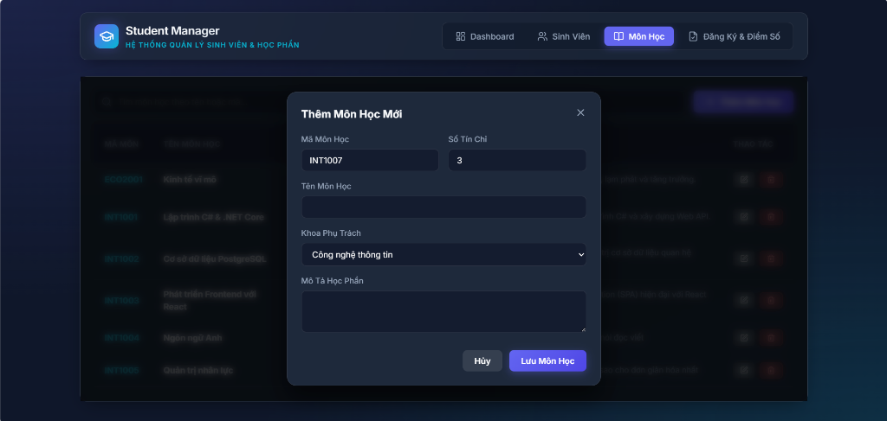
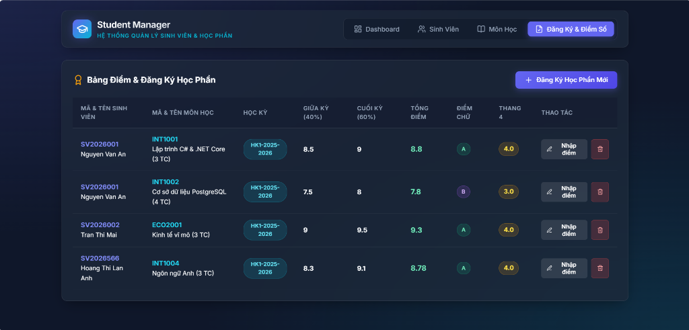

# Student Management System (SMS)

## Project Description

Hệ thống quản lý sinh viên (SMS) hỗ trợ vận hành công tác sinh viên, danh mục môn học, đăng ký học phần và quản lý điểm số theo kiến trúc Microservices phân tán qua Web API & YARP Gateway.

Microservices gồm:

| Thư mục | Mô tả |
| :--- | :--- |
| `apps/services/StudentService` | REST API — .NET 9 Web API, Entity Framework Core, PostgreSQL (`student_db`) |
| `apps/services/CourseService` | REST API — .NET 9 Web API, Entity Framework Core, PostgreSQL (`course_db`) |
| `apps/services/EnrollmentService` | REST API — .NET 9 Web API, Entity Framework Core, PostgreSQL (`enrollment_db`) |
| `apps/gateway/ApiGateway` | API Gateway — .NET 9 YARP Reverse Proxy |
| `apps/frontend/student-portal-react` | Giao diện React — Sinh viên, Giảng viên, Quản trị viên |

**Vai trò người dùng:** `ADMIN` (quản trị), `TEACHER` (giảng viên), `STUDENT` (sinh viên).

---

## Installation & Setup

### Yêu cầu

* .NET 9 SDK
* Node.js 18+, npm
* Docker Desktop (PostgreSQL)

### 1. Clone Repository

```bash
git clone https://github.com/NguyenDuong1509/Student-Management-System
cd Student-Management-System
```

### 2. Backend & Docker Setup

**Chạy tự động qua Docker Compose (Khuyên dùng):**

```bash
docker compose up -d --build
```

**Chạy thủ công từng dịch vụ .NET (Local):**

```bash
# Student Service (Port 5001)
cd apps/services/StudentService
dotnet run

# Course Service (Port 5002)
cd apps/services/CourseService
dotnet run

# Enrollment Service (Port 5003)
cd apps/services/EnrollmentService
dotnet run

# API Gateway (Port 5000)
cd apps/gateway/ApiGateway
dotnet run
```

* **API Gateway:** `http://localhost:5000`
* **Health check API:** `http://localhost:5000/api/v1/students`

---

### 3. Frontend Setup

```bash
cd apps/frontend/student-portal-react
npm install
npm run dev
```

* **Web UI:** `http://localhost:5173`

---

### 4. Admin Panel Setup

1. Chạy backend và frontend (bước 2 & 3).
2. Mở `http://localhost:5173`
3. Quản lý dữ liệu hệ thống trực tiếp trên các tab **Dashboard**, **Sinh Viên**, **Môn Học**, **Đăng Ký & Điểm Số**.

---

## Technologies Used

| Layer | Stack |
| :--- | :--- |
| **Backend** | .NET 9.0 (ASP.NET Core Web API), Entity Framework Core 9 |
| **Database** | PostgreSQL 16 (Npgsql Provider) |
| **API Gateway** | YARP (Yet Another Reverse Proxy) v2.3 |
| **Frontend** | React 18, Vite, Lucide Icons, Axios, Glassmorphism CSS |
| **DevOps / Tooling** | Docker Compose, Docker Desktop, npm, .NET CLI |

---

## Main Features

### Trang Quản Trị (`/dashboard`)
* **Dashboard KPI** — Thống kê tổng sinh viên, tổng môn học, số tín chỉ, lượt đăng ký và GPA trung bình toàn trường.
* **Phân bố sinh viên theo Khoa** — Tỷ lệ phần trăm sinh viên thuộc từng khoa (*Công nghệ thông tin, Kinh tế, Ngoại ngữ...*).
* **Thống kê xếp loại điểm** — Số lượng điểm Xuất sắc (A), Giỏi/Khá (B/C), Trung bình/Yếu (D/F).
* **Học phần gần đây** — Bảng hiển thị các lượt đăng ký và điểm số mới cập nhật.

### Quản lý Sinh viên (`/students`)
* **Tìm kiếm & Lọc** — Tìm kiếm sinh viên theo Tên, MSSV, Email và lọc theo Khoa.
* **Hồ sơ sinh viên** — Thêm sinh viên mới, sửa thông tin cá nhân, quản lý trạng thái học tập.

### Quản lý Môn học (`/courses`)
* **Danh mục môn học** — Quản lý mã môn học, tên môn, số tín chỉ, khoa phụ trách và mô tả.

### Đăng ký & Điểm số (`/enrollments`)
* **Đăng ký học phần** — Phân môn học cho sinh viên theo từng học kỳ.
* **Nhập điểm & Quy đổi** — Nhập điểm giữa kỳ (40%), cuối kỳ (60%), tự động quy đổi GPA thang 4.0 và điểm chữ (A, B, C, D, F).

---

## Website screenshot

| Màn hình | Mô tả |
| :--- | :--- |
| *Dashboard tổng quan* |  |
| *Danh mục sinh viên* |  |
| *Danh mục môn học* |  |
| *Đăng ký & Điểm số* |  |

